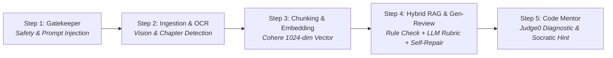

# 🎓 APE (AI-Powered Examination and Programming Practice Platform) — Backend Core API

<p align="center">
  
  
  
  
  
  
  
  
</p>

---

## 📖 Overview

**APE_BE** is the core backend application for the **APE (AI-Powered Examination and Programming Practice Platform)** — an enterprise educational platform designed for computerized examinations, Multiple-Choice Question (FE) practice, and Practical Exam (PE) coding evaluation powered by an autonomous **Multi-Agent AI architecture** and sandboxed code execution.

Engineered with **ASP.NET Core 8 Web API** and **MongoDB**, the platform adheres strictly to **Clean Architecture** principles. It features an automated multi-stage AI pipeline (from document ingestion and OCR vision transcription to hybrid vector retrieval, pedagogical rule validation, rubric evaluation, and self-repair generation loops), high-concurrency sandboxed code evaluation via **Judge0 CE**, and real-time micro-billing through **PayOS VietQR**.

---

## 📑 Table of Contents

- [Core Capabilities](#-core-capabilities)
  - [1. 5-Stage Multi-Agent AI Pipeline](#1-5-stage-multi-agent-ai-pipeline)
  - [2. Sandboxed Code Execution & Grading (Judge0)](#2-sandboxed-code-execution--grading-judge0)
  - [3. AI Wallet, VietQR Top-Up & Fair Micro-Billing](#3-ai-wallet-vietqr-top-up--fair-micro-billing)
  - [4. Gamification & Learning Analytics](#4-gamification--learning-analytics)
- [System Architecture](#-system-architecture)
- [Technology Stack](#-technology-stack)
- [Quality Assurance & Unit Test Suite](#-quality-assurance--unit-test-suite)
- [Getting Started](#-getting-started)
  - [Prerequisites](#1-prerequisites)
  - [Configuration Setup](#2-configuration-setup)
  - [Build & Execution](#3-build--execution)
- [Repository Directory Structure](#-repository-directory-structure)
- [Capstone Project Information](#-capstone-project-information)

---

## ✨ Core Capabilities

### 1. 5-Stage Multi-Agent AI Pipeline



1. **Step 1 — Gatekeeper Agent (`deepseek-v4-flash` / `gpt-4o-mini`)**:
   - Deterministic pre-checks (language, length) with zero token cost.
   - Comprehensive safety analysis: Academic domain matching (Java/OOP), content safety, anti-spam, and **Prompt Injection defense**.
2. **Step 2 — Document Extraction & Chapter Detection (`gpt-4o` / `gpt-4o-mini`)**:
   - Parses `.pdf`, `.docx`, and `.pptx` academic files.
   - Stage 1: **Vision OCR** transcriptions for architectural UML diagrams and screenshots.
   - Stage 2: Markdown normalization, code block formatting, and table cleansing.
   - Stage 3: Automated hierarchical **Chapter & Topic structure detection**.
3. **Step 3 — Semantic Chunking, Vector Embedding & Auto-Tagging**:
   - Semantic boundary chunking (500–1000 tokens) with 100-token overlap.
   - High-performance vectorization using **Cohere `embed-multilingual-v3.0` (float[1024])**.
   - Automated taxonomy auto-tagging stored directly into MongoDB.
4. **Step 4 — Hybrid RAG, Multi-Agent Generation & 3-Tier Review Loop**:
   - **Hybrid Retrieval**: Combines metadata filtering (Chapter/Topic) with Vector Cosine Similarity within a strict Token Budget.
   - **Generator Agent (`gpt-5.4` / `deepseek-v4-pro`)**: Produces FE (MCQ with pedagogical rationales) and PE (coding problems with visible/hidden test cases).
   - **Tier 1 (Rule-Based C# Review)**: Deterministic validation for schema conformity, OOP structure, anti-demo duplication (`GetLowValuePeIssues`), and structural fingerprinting (`QuestionFingerprinting.Build`).
   - **Tier 2 (LLM Reviewer Agent `gpt-5.4-mini` / `deepseek-v4-flash`)**: Pedagogical rubric scoring, distractor plausibility, and edge-case test coverage.
   - **Tier 3 (Self-Repair & Attempt Loop)**: Automated JSON repair and multi-attempt revision loop (up to 3 attempts) feeding back reviewer issues.
5. **Step 5 — Socratic Code Mentor (`gpt-5.4` / `deepseek-v4-pro`)**:
   - `ExecutionFeedbackDiagnosticParser`: Extracts compiler errors, runtime exceptions, and failing test cases from Judge0.
   - Provides **Socratic Guidance**: Thought-provoking diagnostic hints that guide students toward self-debugging without giving away the direct code solution.

---

### 2. Sandboxed Code Execution & Grading (Judge0)

- Asynchronous background worker (`SubmissionGradingBackgroundWorker`) with race-condition-free attempt allocation.
- Sandboxed compilation and execution supporting multi-language environments (**Java, C#, C, C++, Python**).
- **Strict Hidden Test Result Masking**: Obfuscates private evaluation test cases to completely eliminate answer-leak vulnerabilities.

---

### 3. AI Wallet, VietQR Top-Up & Fair Micro-Billing

- **PayOS Integration**: Automated top-up orders with HMAC-SHA256 signature verification on incoming webhooks.
- **Fair Post-Pay Billing**: Charges are calculated based on exact token consumption and deducted **only upon successful generation (`Ready`)**.
- **Absorbed Loss Protection**: In edge cases where token usage exceeds minimum required balance, the wallet is zeroed out and excess cost is absorbed, guaranteeing student balances never drop below zero.

---

### 4. Gamification & Learning Analytics

- Daily learning streaks (normalized to UTC+7), automated achievement badges, and global/course leaderboards.
- Granular knowledge mastery analytics tracking proficiency across individual chapters and topics.

---

## 🏛️ System Architecture

The backend follows **Clean Architecture** (Onion Architecture), ensuring complete decoupling of domain business rules from databases, UI frameworks, and third-party AI APIs.

```
APE_BE/
├── 🌐 API/                    # Presentation Layer (27 REST Controllers, Middlewares, Workers, Program.cs)
├── ⚙️ Application/            # Core Business Logic (31 Services, DTOs, Interfaces, Validators)
├── 📦 Domain/                 # Enterprise Domain Entities, Constants, Enums, Aggregates
├── 🔌 Infrastructure/          # External Integrations (MongoDB Driver, AI Clients, Judge0, PayOS)
├── 🧪 BE_UnitTests/           # 863 MSTest Unit Test Cases covering 100% of Backend Services
├── 🔬 BE_IntegrationTests/    # End-to-End API Integration Test Suite
├── 📊 UnitTests_Report/       # 13 Batch Markdown Reports, FunctionList, and Interactive HTML Viewer
├── 🛠️ Tools/                  # Dev Seeding & DB Bootstrap Utilities
└── 📚 docs/                   # AI Architecture Specs, Progress Logs, and Audit Logs
```

---

## 🛠️ Technology Stack

| Layer / Subsystem | Technology | Purpose |
|---|---|---|
| **Runtime & Language** | .NET 8.0 / C# 12 | High-performance, cross-platform enterprise backend |
| **Database** | MongoDB 6.0+ / MongoDB Atlas | Distributed document persistence & Vector storage |
| **AI LLM Providers** | OpenAI (`gpt-5.4`, `gpt-4o`)<br/>DeepSeek (`deepseek-v4-pro`, `deepseek-v4-flash`) | Generation, Review, Socratic Mentoring, Safety Gatekeeper |
| **Vector Embedding** | Cohere (`embed-multilingual-v3.0`) | 1024-dimensional multilingual semantic embedding |
| **Code Execution** | Judge0 CE (v1.13) | Multi-language sandboxed code compilation & test evaluation |
| **Payment Gateway** | PayOS (VietQR) | Automated payment checkout and webhook verification |
| **Authentication** | JWT (HMAC-SHA256) & Google OAuth 2.0 | Role-Based Access Control (RBAC) & Single Sign-On |
| **Testing Framework** | MSTest v3.6.1 / Moq / FluentAssertions | Comprehensive unit and integration test automation |

---

## 🧪 Quality Assurance & Unit Test Suite

The project maintains an exhaustive automated testing suite conforming to FPT University Capstone and MTCA software testing standards, guaranteeing **100% test execution pass rate**.

```
====================================================================================
                        APE BACKEND UNIT TEST METRICS
====================================================================================
  • Total Backend Modules Covered:   14 Modules (Auth, Wallet, AI Ingest, Judge0...)
  • Total Target Functions:          125 Functions (F01 -> F125)
  • Total MSTest Unit Test Cases:    863 Test Cases
  • Test Execution Status:           863 Passed / 0 Failed (100% Pass Rate)
  • Test Distribution (MTCA):
      - 🟢 Normal Cases (N):        Valid business paths and happy flows
      - 🟠 Abnormal / Error (A):    Security checks, invalid parameters, exception flows
      - 🟣 Boundary Cases (B):       Edge cases, limit conditions, timeout constraints
====================================================================================
```

---

## 🚀 Getting Started

### 1. Prerequisites

- **.NET 8.0 SDK** (v8.0.x or newer): [Download .NET 8.0](https://dotnet.microsoft.com/download/dotnet/8.0)
- **MongoDB**: Local MongoDB instance (`mongodb://localhost:27017`) or MongoDB Atlas URI.
- **Judge0 CE**: Local Docker instance or remote cloud endpoint.

---

### 2. Configuration Setup

Configure `API/appsettings.Development.json` or `.env` in the root directory:

```json
{
  "ConnectionStrings": {
    "MongoDb": "mongodb://localhost:27017/APE_DB"
  },
  "Jwt": {
    "Secret": "YourSuperSecretSigningKeyAtLeast32BytesLong!",
    "Issuer": "APE_Backend",
    "Audience": "APE_Frontend",
    "AccessTokenExpirationMinutes": 60,
    "RefreshTokenExpirationDays": 7
  },
  "GoogleAuth": {
    "ClientId": "your-google-client-id.apps.googleusercontent.com"
  },
  "PayOS": {
    "ClientId": "your-payos-client-id",
    "ApiKey": "your-payos-api-key",
    "ChecksumKey": "your-payos-checksum-key"
  },
  "Judge0": {
    "BaseUrl": "http://localhost:2358",
    "ApiKey": ""
  }
}
```

---

### 3. Build & Execution

#### Restore NuGet Packages and Build:
```powershell
dotnet restore
dotnet build APE_Core.sln
```

#### Run the Web API:
```powershell
dotnet run --project API/API.csproj
```
- 🌐 **Interactive Swagger Documentation:** Access `http://localhost:5292/swagger` in your browser.

#### Execute Unit Tests:
```powershell
dotnet test BE_UnitTests/BE_UnitTests.csproj
```

---

## 📂 Repository Directory Structure

```
APE_BE/
│
├── 📂 API/                                  # Presentation & Web API Layer
│   ├── 📂 Controllers/                      # 27 REST API Controllers
│   ├── 📂 Middlewares/                      # Global exception & JWT authentication middlewares
│   ├── 📂 Workers/                          # Background services (Submission grading worker)
│   └── 📄 Program.cs                        # Application entry, DI registration & pipeline
│
├── 📂 Application/                          # Business Logic & Orchestration Layer
│   ├── 📂 Services/                         # 31 Domain services (AI QGen, Ingestion, Billing, Judge0)
│   ├── 📂 DTOs/                             # Request and Response Data Transfer Objects
│   ├── 📂 Interfaces/                       # Service & Repository contracts
│   └── 📂 Constants/                        # Error codes, role definitions, and system constraints
│
├── 📂 Domain/                               # Enterprise Domain & Invariants Layer
│   ├── 📂 Entities/                         # MongoDB document entities
│   ├── 📂 Enums/                            # Enumeration types (Role, Status, Difficulty, Taxonomies)
│   └── 📂 Constants/                        # AIAgentCatalog & system defaults
│
├── 📂 Infrastructure/                       # External Integrations & Persistence Layer
│   ├── 📂 Persistence/                      # MongoDB repositories & Unit of Work implementation
│   ├── 📂 Judge0/                           # Judge0 CE client adapter
│   └── 📂 Services/                         # PayOS client & LLM provider HTTP clients
│
├── 📂 BE_UnitTests/                         # 863 MSTest Unit Test Cases Suite
├── 📂 BE_IntegrationTests/                  # End-to-End API Integration Test Suite
├── 📂 UnitTests_Report/                     # 13 Batch Markdown Reports & Interactive HTML Viewer
├── 📂 docs/                                 # Technical Specifications, Progress & Agent Logs
├── 📂 Tools/                                # Database Bootstrap & Migration Scripts
├── 📄 APE_Core.sln                          # Master Visual Studio Solution
└── 📄 README.md                             # Repository Master Documentation (This file)
```

---

## 🎓 Capstone Project Information

- **Project**: APE — AI-Powered Examination and Programming Practice Platform
- **Group**: `SEP490_G26`
- **Institution**: FPT University Hanoi — Department of Computer Science & Software Engineering
- **Academic Advisor**: MSc. Nguyen Manh Hien
- **Outcome**: **Official Graduation Defense Passed on First Attempt ✅**
