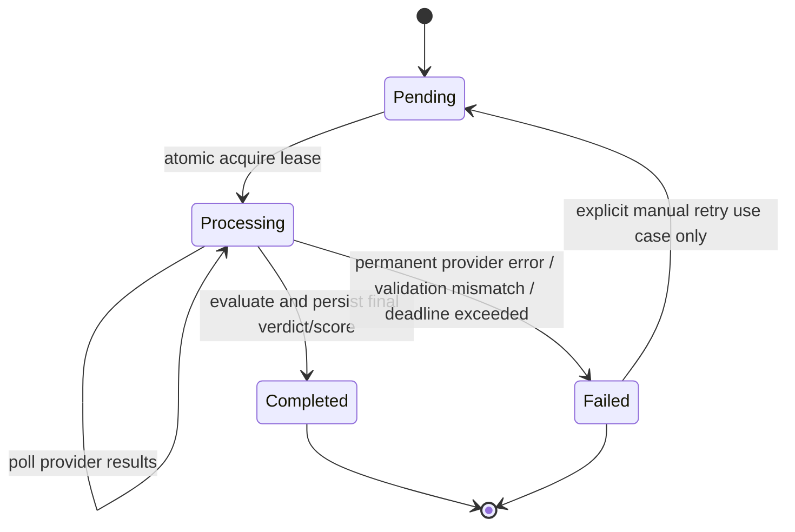
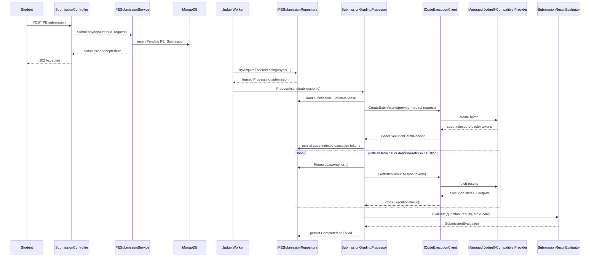

# Managed Judge Architecture for APE

Date: 2026-07-30

Scope:
- Architecture only.
- Based on actual repository code and current types.
- No implementation changes were made.
- No `.cs`, `.csproj`, `.json`, `.sln`, test, package, NuGet, or runtime configuration file was changed.

## 1. Purpose

This document defines the target architecture for rewriting APE PE grading from a self-host/local Judge0 assumption to a managed external Judge0-compatible provider.

It is grounded in the current repository state documented in:
- [`docs/judge-rewrite/00_CURRENT_STATE_AUDIT.md`](C:\Users\FPT SHOP\Desktop\APE_2\APE_BE\docs\judge-rewrite\00_CURRENT_STATE_AUDIT.md)

and in the current implemented types, especially:
- [`Domain/Entities/PE_Submission.cs`](C:\Users\FPT SHOP\Desktop\APE_2\APE_BE\Domain\Entities\PE_Submission.cs)
- [`Domain/Entities/PEQuestion.cs`](C:\Users\FPT SHOP\Desktop\APE_2\APE_BE\Domain\Entities\PEQuestion.cs)
- [`Application/Interfaces/ICodeExecutionClient.cs`](C:\Users\FPT SHOP\Desktop\APE_2\APE_BE\Application\Interfaces\ICodeExecutionClient.cs)
- [`Application/Services/SubmissionGradingProcessor.cs`](C:\Users\FPT SHOP\Desktop\APE_2\APE_BE\Application\Services\SubmissionGradingProcessor.cs)
- [`Application/Services/SubmissionResultEvaluator.cs`](C:\Users\FPT SHOP\Desktop\APE_2\APE_BE\Application\Services\SubmissionResultEvaluator.cs)
- [`Infrastructure/Persistence/PESubmissionRepository.cs`](C:\Users\FPT SHOP\Desktop\APE_2\APE_BE\Infrastructure\Persistence\PESubmissionRepository.cs)
- [`Infrastructure/Judge0/Judge0Client.cs`](C:\Users\FPT SHOP\Desktop\APE_2\APE_BE\Infrastructure\Judge0\Judge0Client.cs)
- [`API/Workers/Judge0Worker.cs`](C:\Users\FPT SHOP\Desktop\APE_2\APE_BE\API\Workers\Judge0Worker.cs)

## 2. Target Workflow

Target workflow:

```text
SubmissionController
-> PESubmissionService
-> persist Pending PE_Submission
-> grading worker
-> atomic processing lease
-> SubmissionGradingProcessor
-> provider-neutral ICodeExecutionClient
-> managed external Judge0-compatible provider
-> persist case-indexed execution tokens
-> poll results
-> SubmissionResultEvaluator
-> Completed or Failed
```

The external provider is treated only as a compile/run sandbox. APE remains responsible for business correctness, secrecy of hidden tests, scoring, and auditability.

## 3. Core Architecture Decisions

### 3.1 What APE keeps responsibility for

APE must remain responsible for:
- authentication and authorization
- practice/session validation
- question ownership and exam membership validation
- allowed-language validation
- hidden testcase ownership
- expected outputs
- output normalization
- final verdict
- score
- student attempt tracking
- provider execution retry policy
- audit trail

This is consistent with current separation:
- controller/service authorization and ownership checks
- `PEQuestion.ResolveLanguageId(...)`
- `SubmissionResultEvaluator`
- hidden response sanitization in `PESubmissionService`

### 3.2 What the provider does

The managed external provider is only a compile/run sandbox.

Provider scope:
- receive source package
- run source against standard input
- return execution status, stdout, stderr, compile output, runtime, and memory

Provider is not trusted for:
- question correctness
- hidden testcase ownership
- expected outputs
- scoring
- business verdict

### 3.3 Application contracts must become provider-neutral

Current `Application` contracts still leak Judge0 semantics via:
- `CodeExecutionResult.StatusId`
- `CodeExecutionResult.StatusDescription`
- `IsQueued / IsProcessing / IsFinished` inferred from Judge0 numeric status ids

Target decision:
- remove Judge0-specific status ids from `Application` contracts
- replace them with a provider-neutral execution state model

### 3.4 Explicit case mapping replaces implicit list-position mapping

Current implementation assumes:
- `executionResults[index]` corresponds to `question.TestCases[index]`

That is workable for the current adapter, but it is too implicit for a managed external provider architecture.

Target decision:
- every execution case must be identified explicitly by:
  - `CaseIndex`
  - `ProviderToken`

APE must persist token-to-case mapping, not just a plain token list.

### 3.5 `PEQuestion.SolutionCode` must never be sent to provider

Current flow already uses submitted code only.

Target rule:
- provider requests may include only student-submitted source files plus runtime packaging artifacts
- `PEQuestion.SolutionCode` is never sent to provider
- hidden expected outputs are never sent to provider

### 3.6 Expected outputs are not sent to the provider

Target contract must not send `ExpectedOutput` to the provider.

Reasons:
- **security**: hidden expected outputs are answer keys; sending them to the provider increases blast radius if the provider or its logs are compromised
- **portability**: keeping correctness evaluation inside APE avoids coupling to Judge0-only result semantics such as provider-side wrong-answer detection
- **consistency**: APE already owns final verdict and score; moving output comparison into APE makes the evaluator authoritative
- **future compatibility**: a provider-neutral compile/run sandbox should only need source code, stdin, and resource limits

## 4. Current Types to Keep

These current types should be kept and evolved rather than replaced outright:

- [`Domain/Entities/PE_Submission.cs`](C:\Users\FPT SHOP\Desktop\APE_2\APE_BE\Domain\Entities\PE_Submission.cs)
  - keep as the submission aggregate root
- `TestResultItem`
  - keep as persisted final evaluated testcase result
- `SubmissionEvaluation`
  - keep as evaluator output
- [`Domain/Entities/PEQuestion.cs`](C:\Users\FPT SHOP\Desktop\APE_2\APE_BE\Domain\Entities\PEQuestion.cs)
  - keep as question aggregate/data source for allowed languages and testcases
- [`Domain/Entities/CommonTypes.cs`](C:\Users\FPT SHOP\Desktop\APE_2\APE_BE\Domain\Entities\CommonTypes.cs)
  - keep `CodeFile`
  - keep `TestCase`
- [`Application/Services/PESubmissionService.cs`](C:\Users\FPT SHOP\Desktop\APE_2\APE_BE\Application\Services\PESubmissionService.cs)
  - keep ownership and input validation role
- [`Application/Services/SubmissionGradingProcessor.cs`](C:\Users\FPT SHOP\Desktop\APE_2\APE_BE\Application\Services\SubmissionGradingProcessor.cs)
  - keep orchestration role
- [`Application/Services/SubmissionResultEvaluator.cs`](C:\Users\FPT SHOP\Desktop\APE_2\APE_BE\Application\Services\SubmissionResultEvaluator.cs)
  - keep APE-side evaluation role
- [`Application/Interfaces/ICodeExecutionClient.cs`](C:\Users\FPT SHOP\Desktop\APE_2\APE_BE\Application\Interfaces\ICodeExecutionClient.cs)
  - keep abstraction boundary, but refactor contract shape
- [`Application/Interfaces/IPESubmissionRepository.cs`](C:\Users\FPT SHOP\Desktop\APE_2\APE_BE\Application\Interfaces\IPESubmissionRepository.cs)
  - keep repository abstraction, extend for lease semantics
- [`Infrastructure/Persistence/PESubmissionRepository.cs`](C:\Users\FPT SHOP\Desktop\APE_2\APE_BE\Infrastructure\Persistence\PESubmissionRepository.cs)
  - keep Mongo implementation role
- [`Infrastructure/Judge0/Judge0SourcePackageBuilder.cs`](C:\Users\FPT SHOP\Desktop\APE_2\APE_BE\Infrastructure\Judge0\Judge0SourcePackageBuilder.cs)
  - keep packaging strategy and validation logic
- [`API/Workers/Judge0Worker.cs`](C:\Users\FPT SHOP\Desktop\APE_2\APE_BE\API\Workers\Judge0Worker.cs)
  - keep thin worker role, refactor around leases

## 5. Types to Refactor

### 5.1 `PE_Submission`

Keep the aggregate, refactor its execution-tracking model.

Current execution data:
- `ExecutionTracking.Tokens: IReadOnlyCollection<string>`
- `ExecutionTracking.AttemptCount`
- `ExecutionTracking.LastAttemptAt`
- `ExecutionTracking.LastError`

Target needs:
- case-indexed tokens
- lease ownership and expiry
- provider execution metadata
- polling metadata

### 5.2 `ICodeExecutionClient`

Current shape:

```csharp
Task<CodeExecutionBatchReceipt> CreateBatchAsync(CodeExecutionBatchRequest request, ...)
Task<IReadOnlyList<CodeExecutionResult>> GetBatchResultsAsync(IReadOnlyCollection<string> tokens, ...)
Task<bool> IsHealthyAsync(...)
```

Refactor direction:
- keep the same role
- replace Judge0-shaped result state with provider-neutral state
- move from plain token collection to explicit case-indexed request/receipt/result model

### 5.3 `CodeExecutionBatchRequest`

Current shape couples provider request to full `TestCase`, which includes expected output.

Refactor direction:
- remove provider need for `ExpectedOutput`
- send only compile/run inputs and limits
- keep testcase metadata for APE-side evaluation in the processor/evaluator path, not in provider request contract

### 5.4 `CodeExecutionBatchReceipt`

Current shape:
- plain list of strings

Refactor direction:
- include explicit token mapping by case index

### 5.5 `CodeExecutionResult`

Current shape:
- `StatusId`
- `StatusDescription`
- `Token`

Refactor direction:
- remove raw Judge0 `StatusId` from `Application`
- replace with provider-neutral execution state
- carry original provider diagnostics only as opaque metadata for logging/audit

### 5.6 `SubmissionResultEvaluator`

Current evaluator maps raw Judge0 status ids.

Refactor direction:
- evaluator must consume provider-neutral `CodeExecutionState`
- evaluator must normalize output and compare against `PEQuestion.TestCases`
- evaluator remains the source of truth for correctness and final verdict

### 5.7 `PESubmissionRepository`

Current repository supports:
- `TryClaimPendingAsync(...)`

Refactor direction:
- add lease acquire/renew/reclaim operations
- preserve atomicity
- address student submission attempt concurrency

## 6. Proposed New Types

These new types are proposed only where no equivalent currently exists.

### 6.1 Provider-neutral execution state

```csharp
public enum CodeExecutionState
{
    Queued,
    Running,
    Succeeded,
    CompilationFailed,
    RuntimeFailed,
    TimedOut,
    OutputLimitExceeded,
    MemoryLimitExceeded,
    ProviderInternalError,
    Unknown
}
```

Notes:
- This enum belongs in `Application`, not `Infrastructure`.
- It intentionally avoids Judge0 status ids.
- `Succeeded` means "compile/run completed successfully", not "student answer accepted".

### 6.2 Explicit execution case request

```csharp
public sealed record CodeExecutionCaseRequest(
    int CaseIndex,
    string StandardInput,
    int TimeLimitMs,
    int MemoryLimitKb);
```

### 6.3 Refined batch request

```csharp
public sealed class CodeExecutionBatchRequest
{
    public int LanguageId { get; }
    public IReadOnlyList<CodeFile> SourceFiles { get; }
    public IReadOnlyList<CodeExecutionCaseRequest> Cases { get; }
    public bool IsMultiFile { get; }
}
```

### 6.4 Explicit token mapping

```csharp
public sealed record CodeExecutionToken(
    int CaseIndex,
    string ProviderToken);
```

### 6.5 Refined batch receipt

```csharp
public sealed class CodeExecutionBatchReceipt
{
    public string ProviderName { get; }
    public IReadOnlyList<CodeExecutionToken> Tokens { get; }
}
```

### 6.6 Refined provider result

```csharp
public sealed record CodeExecutionResult(
    int CaseIndex,
    string ProviderToken,
    CodeExecutionState State,
    string? StandardOutput,
    string? StandardError,
    string? CompileOutput,
    string? Message,
    double? TimeSeconds,
    int? MemoryKb,
    string? ProviderStatusCode,
    string? ProviderStatusDescription);
```

### 6.7 Lease model in domain

```csharp
public sealed class ProcessingLease
{
    public string LeaseOwner { get; private set; } = string.Empty;
    public DateTime LeaseAcquiredAt { get; private set; }
    public DateTime LeaseExpiresAt { get; private set; }
}
```

This may live either:
- as a nested execution/processing model inside `PE_Submission`, or
- as top-level fields on `PE_Submission`

The important part is that it becomes part of the persisted aggregate state.

### 6.8 Persisted provider execution case

```csharp
public sealed class ExecutionCaseTracking
{
    public int CaseIndex { get; private set; }
    public string ProviderToken { get; private set; } = string.Empty;
}
```

## 7. Refined Domain Model

### 7.1 `PE_Submission` target responsibilities

`PE_Submission` should remain the owner of:
- student submission attempt number
- execution-processing lifecycle
- processing lease
- provider execution attempt count
- persisted case-token map
- persisted final testcase results

### 7.2 Distinguish attempt counters explicitly

Current code already has two concepts:
- `PE_Submission.AttemptCount`
- `ExecutionTracking.AttemptCount`

Target decision:
- rename conceptually and document clearly as:
  - `SubmissionAttemptNumber`
  - `ExecutionAttemptCount`

Meaning:
- `SubmissionAttemptNumber`: the nth student submission for `(SessionId, QuestionId)`
- `ExecutionAttemptCount`: the nth provider execution/retry for the same submission record

These must never be conflated.

### 7.3 Execution tracking target shape

Target persisted execution state should include:
- `ExecutionAttemptCount`
- `LastAttemptAt`
- `LastError`
- `ProviderName`
- `BatchCreatedAt`
- `LastPollAt`
- `PollCount`
- `TransientFailureCount`
- `ExecutionCaseTracking[]`
- `ProcessingLease`

## 8. State Transition Model

### 8.1 State-transition diagram



### 8.2 Lease semantics

Required lease fields:
- `LeaseOwner`
- `LeaseAcquiredAt`
- `LeaseExpiresAt`

Lease rules:
- acquire is atomic
- only lease owner may renew lease
- processing continues only while lease is valid
- expired lease may be reclaimed by another worker
- once lease is lost, the current worker must stop mutating the submission

Lost lease behavior:
- processor should abort current polling/update loop as soon as lease ownership is no longer valid
- worker should treat lost lease as a concurrency event, not as provider failure

## 9. Sequence Diagram



## 10. Processor Architecture

### 10.1 Required orchestration steps

`SubmissionGradingProcessor` should evolve to:
1. load submission
2. verify `Processing` state
3. verify lease ownership and expiry
4. load `PEQuestion`
5. validate testcase presence and submission/package assumptions
6. if no persisted tokens:
   - build provider-neutral batch request
   - call provider client
   - validate one token per case
   - persist case-indexed tokens immediately
7. if tokens already exist:
   - resume polling existing tokens
8. poll until:
   - all cases are terminal
   - polling deadline reached
   - lease lost
   - permanent error occurs
9. evaluate with APE-local evaluator
10. persist `Completed` or `Failed`

### 10.2 Provider-batch failure window

Known failure window:
- provider accepts batch creation
- application crashes before token persistence

Architecture rule:
- do not claim exactly-once execution unless the external provider supports idempotent batch creation keyed by a stable submission execution key

If provider supports idempotency:
- use a stable key derived from:
  - `SubmissionId`
  - `ExecutionAttemptCount`

If provider does not support idempotency:
- architecture must document the window explicitly
- duplicate batch execution remains possible in rare crash scenarios
- audit trail should record suspected duplicate execution conditions

## 11. Evaluator Architecture

### 11.1 Ownership

`SubmissionResultEvaluator` remains in `Application` and remains responsible for:
- mapping provider-neutral execution states to domain verdicts
- output normalization
- expected-output comparison
- hidden testcase masking policy through `TestResultItem`
- score input preparation for `ISubmissionScoringService`

### 11.2 Output normalization

APE must normalize provider outputs before correctness comparison.

At minimum:
- normalize line endings
- trim trailing newline noise consistently
- preserve deterministic comparison rules across providers

### 11.3 Hidden testcase ownership

Hidden testcase values remain owned by APE:
- hidden input
- hidden expected output
- hidden actual output visibility policy in responses

Provider never becomes the authority for hidden testcase correctness.

## 12. Error Model and Retry Policy

### 12.1 Permanent provider failures

Permanent categories:
- HTTP `400`
- HTTP `401`
- HTTP `403`
- HTTP `404`
- HTTP `422`
- malformed unsupported source package
- unsupported language within current product scope
- irrecoverable response schema mismatch

Outcome:
- fail submission processing
- persist diagnostic
- do not retry indefinitely

### 12.2 Transient provider failures

Transient categories:
- HTTP `408`
- HTTP `429`
- HTTP `5xx`
- timeout
- network interruption
- socket/connectivity interruption
- provider response incomplete but plausibly recoverable

Outcome:
- bounded retry with exponential backoff and jitter

### 12.3 Retry-After support

For `429` responses:
- if `Retry-After` exists and is valid, respect it
- cap by processor absolute deadline

### 12.4 Backoff policy

Recommended policy:
- bounded exponential backoff with jitter
- preserve current spirit of `InitialRetryDelaySeconds`
- separate:
  - provider batch creation retry policy
  - provider polling retry policy

### 12.5 Absolute polling deadline

Architecture requirement:
- polling must stop at an absolute deadline, not just a count of loop iterations

Current `MaximumPollingAttempts` is useful but not expressive enough by itself for managed external-provider latency variability.

Recommended future config shape:
- `MaximumPollingSeconds`
- `LeaseSeconds`
- `LeaseRenewalSeconds`
- `MaximumTransientFailures`

## 13. Hidden-Data Policy

### 13.1 Provider requests

Must not send:
- `PEQuestion.SolutionCode`
- hidden expected outputs
- hidden input ownership metadata
- MongoDB connection string
- JWT secret
- provider secrets not required by transport layer

Provider request may send:
- student source files
- per-case stdin
- per-case limits
- runtime packaging scripts for current multi-file support

### 13.2 API responses

Student-facing response must keep current hidden masking rule:
- hidden input -> `null`
- hidden expected output -> `null`
- hidden actual output -> `null`

Verdict and timing may still be shown according to product rules.

### 13.3 Logs

Logs must not contain:
- source code unless explicitly required and redacted by policy
- hidden expected outputs
- provider API keys or auth headers
- committed application secrets

Logs may contain:
- submission id
- session id
- provider token hashes or redacted tokens if needed
- provider error category
- retry counts
- lease owner

### 13.4 Exceptions

Exceptions returned to API callers must not leak:
- provider auth details
- hidden testcase values
- raw provider internals beyond safe operational messages

## 14. Current Multi-File Scope

Current product scope for multi-file submissions is:
- C
- Java

This is derived from:
- [`Infrastructure/Judge0/Judge0MultiFileProfileResolver.cs`](C:\Users\FPT SHOP\Desktop\APE_2\APE_BE\Infrastructure\Judge0\Judge0MultiFileProfileResolver.cs)

Architecture interpretation:
- this is the **current product scope**
- it is **not** a permanent architecture limit

The managed architecture should preserve this scope while keeping room to add more languages later without redesigning the application contract.

## 15. Persistence Changes

### 15.1 Submission persistence additions

`PE_Submission` persistence should evolve to include:
- lease fields
- case-indexed provider tokens
- provider execution metadata
- polling metadata

### 15.2 Repository contract additions

`IPESubmissionRepository` should be extended with operations such as:

```csharp
Task<PE_Submission?> TryAcquireForProcessingAsync(
    string submissionId,
    string leaseOwner,
    DateTime leaseAcquiredAt,
    DateTime leaseExpiresAt,
    CancellationToken cancellationToken = default);

Task<bool> RenewLeaseAsync(
    string submissionId,
    string leaseOwner,
    DateTime newLeaseExpiresAt,
    CancellationToken cancellationToken = default);

Task<bool> HasLeaseAsync(
    string submissionId,
    string leaseOwner,
    DateTime utcNow,
    CancellationToken cancellationToken = default);
```

Exact names may vary, but these capabilities are required.

### 15.3 Current concurrency risk in student attempt numbering

Current student attempt numbering logic:
- `GetLatestAttemptNumberAsync(sessionId, questionId) + 1`

Current risk:
- two concurrent submissions for the same `(SessionId, QuestionId)` can read the same latest attempt and both choose the same next number

Architecture finding:
- this is a real concurrency risk even if current index state in the live DB is unknown
- the architecture must assume that uniqueness must be enforced either by:
  - durable unique index on `(SessionId, QuestionId, SubmissionAttemptNumber)`, or
  - atomic sequence allocation, or
  - transactional retry pattern

### 15.4 Mongo index requirements

Document required Mongo indexes for the target architecture:

1. Student attempt uniqueness:
```text
{ SessionId: 1, QuestionId: 1, SubmissionAttemptNumber: 1 } unique
```

2. Latest attempt lookup:
```text
{ SessionId: 1, QuestionId: 1, SubmissionAttemptNumber: -1 }
```

3. Worker queue and lease reclaim:
```text
{ Status: 1, LeaseExpiresAt: 1, SubmittedAt: 1 }
```

4. Session query:
```text
{ SessionId: 1, SubmittedAt: -1 }
```

Important scope note:
- this document identifies index requirements only
- it does not modify `DbInitializer`

## 16. Worker Architecture

### 16.1 Worker responsibilities

The background worker should remain thin and should:
- generate a stable `LeaseOwner` identity per process instance
- query candidate submissions
- atomically acquire or reclaim expired leases
- create scope per work item or per batch
- invoke `SubmissionGradingProcessor`
- isolate exceptions per item
- respect shutdown cancellation
- avoid direct Judge0 HTTP knowledge

### 16.2 Lost lease behavior

If lease ownership is lost:
- worker or processor must stop mutating the submission
- this is treated as a concurrency/recovery event
- not as provider failure

### 16.3 Deployment posture

For MVP:
- API and worker stay in one process/task
- desired count = 1

For future scale:
- worker can move to dedicated service
- message-driven dispatch can be added later

## 17. Infrastructure Adapter Architecture

### 17.1 `Judge0Client` role

Keep `Judge0Client` as the managed Judge0-compatible adapter in `Infrastructure`.

Responsibilities:
- translate provider-neutral `Application` models into provider HTTP requests
- send configured provider headers
- classify provider/network errors
- map provider statuses into provider-neutral `CodeExecutionState`
- decode provider payloads and diagnostics

### 17.2 HTTP contract placement

Judge0-specific HTTP DTOs should remain in `Infrastructure/Judge0`.

`Application` must not depend on:
- `Judge0SubmissionRequest`
- `Judge0StatusResponse`
- `status_id`
- `additional_files` transport details

### 17.3 Configuration model

Current repo has:
- `Judge0` section in [`API/appsettings.json`](C:\Users\FPT SHOP\Desktop\APE_2\APE_BE\API\appsettings.json)
- `Judge0Options`

Architecture direction:
- keep a dedicated configuration model
- allow managed provider headers and endpoint overrides
- remove localhost assumptions from deployment defaults

## 18. Deployment Architecture

### 18.1 MVP deployment

MVP target:
- API and worker in one ECS task
- desired count `1`
- MongoDB Atlas
- AWS Secrets Manager
- managed Judge0-compatible provider

Rationale:
- simplest operational migration from current `BackgroundService` model
- no queue coordination complexity
- matches current repository shape

### 18.2 Future deployment

Future target:
- dedicated worker ECS service
- Amazon SQS between submit path and grading path
- dead-letter queue

Rationale:
- independent scaling
- backlog smoothing
- operational isolation

### 18.3 Blocking AWS deployment issue

Committed secrets in [`API/appsettings.json`](C:\Users\FPT SHOP\Desktop\APE_2\APE_BE\API\appsettings.json) are a blocking AWS deployment issue.

Blocking items currently committed:
- MongoDB connection string
- JWT secret
- Google client id

This task does not rotate or edit those secrets, but the architecture must flag them as a deployment blocker.

## 19. Compatibility and Migration Plan

### Phase 1: Stabilize domain vocabulary

- keep `PE_Submission`
- clarify and evolve execution-tracking model
- add explicit lease fields
- add explicit case-token mapping
- document `SubmissionAttemptNumber` vs `ExecutionAttemptCount`

### Phase 2: Refactor `Application` contracts

- refactor `ICodeExecutionClient`
- refactor `CodeExecutionBatchRequest`
- refactor `CodeExecutionBatchReceipt`
- refactor `CodeExecutionResult`
- remove Judge0 status ids from `Application`

### Phase 3: Refactor evaluator

- make `SubmissionResultEvaluator` consume provider-neutral states
- keep APE-local expected-output comparison and score calculation

### Phase 4: Add lease-aware repository operations

- atomic acquire
- renew
- reclaim expired lease
- protect against lost-lease writes

### Phase 5: Refactor processor

- persist case-indexed tokens immediately after batch creation
- resume polling based on persisted mapping
- add absolute polling deadline
- add Retry-After support and jittered backoff

### Phase 6: Refactor worker

- worker identity / lease owner
- reclaim expired leases
- avoid status-only opportunistic processing

### Phase 7: Infrastructure adapter rewrite

- map managed provider HTTP schema to provider-neutral states
- keep current C/Java multi-file scope
- avoid sending `ExpectedOutput`

### Phase 8: Deployment hardening

- remove committed secrets from runtime config
- move secrets to AWS Secrets Manager
- keep single-task MVP deployment first

### Phase 9: Queue-based future

- add SQS
- split worker service from API service
- add DLQ

## 20. Known Limitations

These are accepted limitations or realities to document up front:

1. Exactly-once provider execution is not guaranteed unless provider idempotency exists.
2. Current multi-file scope remains C and Java only.
3. Live Mongo index state is not verified by code inspection alone.
4. Current repository has minimal active automated test coverage for PE grading.
5. Current appsettings still reflect localhost/self-host assumptions and committed secrets.

## 21. Non-Goals

This architecture does not aim to:
- redesign FE submission flow
- redesign document/AI ingestion architecture
- replace MongoDB
- implement a generic multi-provider abstraction beyond what PE grading needs
- change product scoring policy itself
- expand language support beyond current product scope in this phase
- fix database initialization in this task

## 22. Human Decisions Needed

The following decisions require explicit product/engineering confirmation:

1. Should the managed provider support provider-side idempotency keys?
   - If yes, define exact request key format.

2. What is the authoritative output normalization rule?
   - newline-only normalization
   - trim trailing whitespace
   - exact byte comparison after normalization

3. What absolute polling deadline is acceptable per submission?
   - product latency and cost tradeoff

4. How should provider tokens be logged?
   - full token
   - hashed token
   - partially redacted token

5. Is `Application/DTOs/PESubmissionDto.cs` officially deprecated?
   - current controller path suggests yes, but cleanup should be confirmed.

6. What is the desired managed provider auth model?
   - custom header
   - bearer token
   - multi-header scheme

## 23. Recommended Outcome

The managed judge rewrite should be an incremental refactor, not a full replacement.

Recommended end state:
- preserve the current `PE_Submission`-centered workflow
- preserve `PESubmissionService`, `SubmissionGradingProcessor`, and `SubmissionResultEvaluator` as core responsibilities
- upgrade execution tracking from raw Judge0 token list to explicit case-indexed managed-provider execution state
- move all provider-specific semantics to `Infrastructure`
- introduce lease-based recovery semantics before scaling beyond one worker instance

