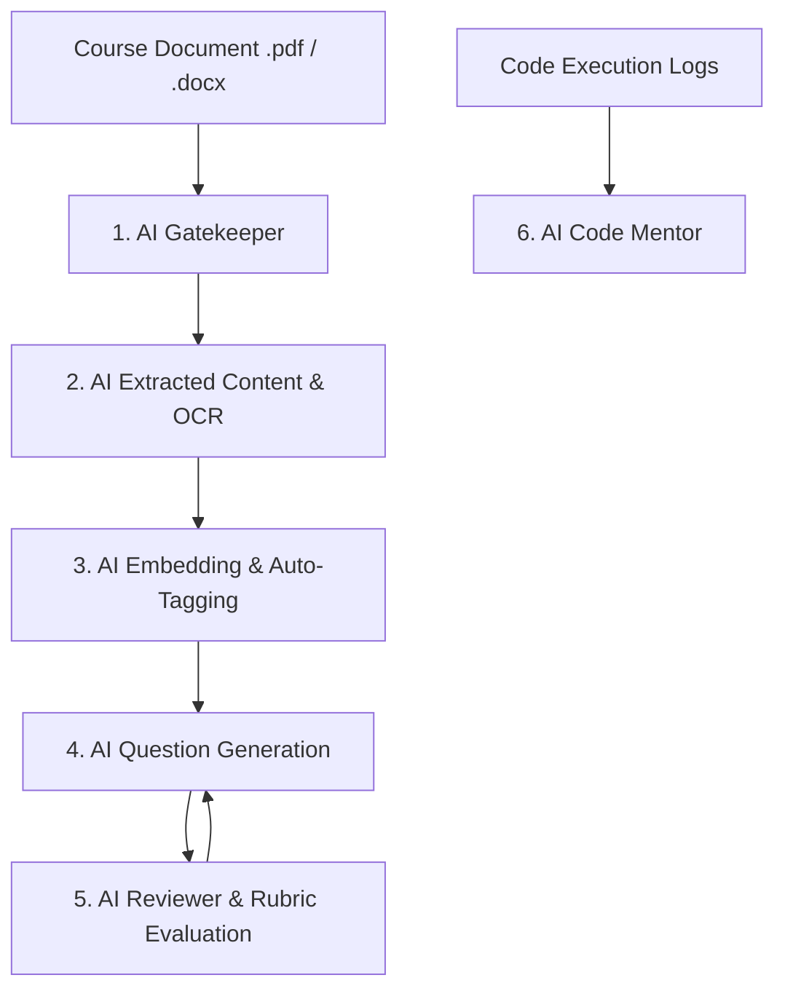

# 🎓 APE (AI-Powered Examination and Programming Practice Platform) — AI Prototype & Benchmark Subsystem

<p align="center">
  
  
  
  
  
  
</p>

---

## 📖 Overview

**Prototype_AI_Module** serves as the foundational **research, token cost benchmarking, prompt engineering testbed, and operator evaluation harness** for the **APE (AI-Powered Examination and Programming Practice Platform)**.

This repository established the core multi-agent orchestration logic, prompt templates, pedagogical rubrics, ground-truth verification datasets, and token cost models that were subsequently engineered and hardened into the production **`APE_BE`** Clean Architecture backend.

---

## 📑 Table of Contents

- [Architectural Scope & Subsystems](#-architectural-scope--subsystems)
- [6 Core AI Functional Prototypes](#-6-core-ai-functional-prototypes)
- [Project Structure](#-project-structure)
- [Getting Started & Local Execution](#-getting-started--local-execution)
- [AI Provider Configuration](#-ai-provider-configuration)
- [Benchmark & Cost Reporting](#-benchmark--cost-reporting)
- [Relation to Production System](#-relation-to-production-system)
- [Capstone Project Information](#-capstone-project-information)

---

## 🏛️ Architectural Scope & Subsystems

This repository is organized into two primary components:

1. **Active .NET AI Module (`src-dotnet/`)**:
   - The primary C# / ASP.NET Core test harness and operator UI.
   - Houses standalone service contracts, dynamic LLM provider dispatchers (OpenAI, DeepSeek, Gemini, Cohere), and file-backed prompt/rubric/policy catalogs.
   - Formed the direct blueprint for the production integration in `APE_BE`.

2. **Legacy Node.js Benchmark Suite (`legacy-node-benchmark/`)**:
   - The initial exploratory benchmarking prototype (Node.js / Express / React).
   - Preserved for historical test data reference and baseline latency/cost comparisons.

---

## ✨ 6 Core AI Functional Prototypes

The subsystem evaluates and benchmarks the 6 core AI capabilities utilized across the APE platform:



1. **AI Gatekeeper (`/api/ai-module/gatekeeper`)**:
   - Filters off-topic materials, content violations, spam, and Prompt Injection attacks using lightweight models.
2. **AI Extracted Content (`/api/ai-module/extracted-content`)**:
   - Visual transcription of architectural UML diagrams, Markdown cleanup, and hierarchical Chapter/Topic detection.
3. **AI Embedding & Auto-Tagging (`/api/ai-module/embedding-tagging`)**:
   - Semantic boundary chunking (500–1000 tokens) with 100-token overlap and vectorization via **Cohere `embed-multilingual-v3.0` (1024-dim)**.
4. **AI Question Generation (`/api/ai-module/generation-review`)**:
   - Multi-format question synthesis across FE (Multiple-Choice) and PE (Practical Coding Problems) grounded on retrieved chunks.
5. **AI Reviewer Result Evaluation (`/api/ai-module/generation-review`)**:
   - Automated evaluation against pedagogical rubrics, distractor quality inspection, edge-case test case validation, and self-repair loops.
6. **AI Code Mentor (`/api/ai-module/code-mentor`)**:
   - Socratic diagnostic evaluation of compiler/runtime diagnostics without direct solution leakage.

---

## 🏗️ Project Structure

```
Prototype_AI_Module/
├── src-dotnet/                          # Active .NET 8/10 Prototype Solution
│   ├── Ape.AiModule.slnx                # Solution manifest
│   └── Ape.AiModule.Api/                # Web API, Operator UI & Service Engine
│       ├── App_Data/                    # File-backed Catalogs & Test Datasets
│       │   ├── ai-prompts.json          # System & User prompt templates
│       │   ├── *-policy.json            # Quality, gatekeeper, and retry policies
│       │   ├── ai-rubrics/              # Pedagogical evaluation rubrics
│       │   ├── ai-groundtruth/          # Benchmark ground truth validation data
│       │   └── run-history/             # Structured JSON logs of benchmark runs
│       ├── wwwroot/                     # Built-in Browser Operator UI
│       └── Program.cs                   # Service registration & API routes
├── Docs/                                # Technical documentation & integration guides
│   └── Prototype_Document/
│       ├── Guides/                      # Run guides, API route maps, and Operator UI guides
│       └── Specs/                       # 6 AI Functions specifications and schemas
├── legacy-node-benchmark/               # Exploratory Node.js / React benchmark suite
├── outputs/                             # Generated benchmark Excel sheets and exports
└── README.md                            # Repository documentation (This file)
```

---

## 🚀 Getting Started & Local Execution

### Prerequisites
- **.NET 8.0 SDK** or **.NET 10.0 Preview SDK** ([Download .NET](https://dotnet.microsoft.com/download)).
- Active API credentials for OpenAI, DeepSeek, Gemini, or Cohere.

### Build and Run the .NET Module
```powershell
# Restore dependencies and build solution
dotnet build src-dotnet/Ape.AiModule.slnx

# Run the API & Operator Web UI
dotnet run --project src-dotnet/Ape.AiModule.Api
```

Once running, access the **Operator UI** directly in your browser at the local port printed in the terminal console (e.g., `http://localhost:5050`).

---

## ⚙️ AI Provider Configuration

Configure API keys in `src-dotnet/Ape.AiModule.Api/.env`:

```env
AIProviders__OpenAI__ApiKey=sk-...
AIProviders__OpenAI__BaseUrl=https://api.openai.com/v1

AIProviders__DeepSeek__ApiKey=sk-...
AIProviders__DeepSeek__BaseUrl=https://api.deepseek.com/v1

AIProviders__Cohere__ApiKey=...
AIProviders__Cohere__BaseUrl=https://api.cohere.com/v1

AI_BENCHMARK_TESTER=your_name
```

---

## 📊 Benchmark & Cost Reporting

- The Operator UI automatically records all prompt tokens, completion tokens, execution latencies, and estimated USD/VND costs into structured JSON files under `App_Data/run-history/`.
- Benchmarking scripts compile these history logs into unified Excel reports (`AI_Benchmark_Report.xlsx`) for empirical accuracy and cost analysis.

---

## 🔗 Relation to Production System

| Prototype Phase (`Prototype_AI_Module`) | Production Integration (`APE_BE` & `APE_FE`) |
|---|---|
| **Storage**: File-backed JSON (`App_Data/`) | **Storage**: MongoDB Distributed Collections |
| **Execution**: Standalone Operator UI | **Execution**: Integrated React 18 Frontend & Monaco Editor |
| **Grading**: Mock test outputs | **Grading**: Real-time sandboxed Judge0 CE execution |
| **Billing**: Offline cost estimation | **Billing**: Real-time PayOS VietQR Wallet & post-pay billing |

---

## 🎓 Capstone Project Information

- **Project**: APE — AI-Powered Examination and Programming Practice Platform
- **Subsystem**: AI Prototype & Multi-Agent Benchmark Harness
- **Group**: `SEP490_G26`
- **Institution**: FPT University Hanoi — Department of Computer Science & Software Engineering
- **Academic Advisor**: MSc. Nguyen Manh Hien
- **Outcome**: **Official Graduation Defense Passed on First Attempt ✅**
