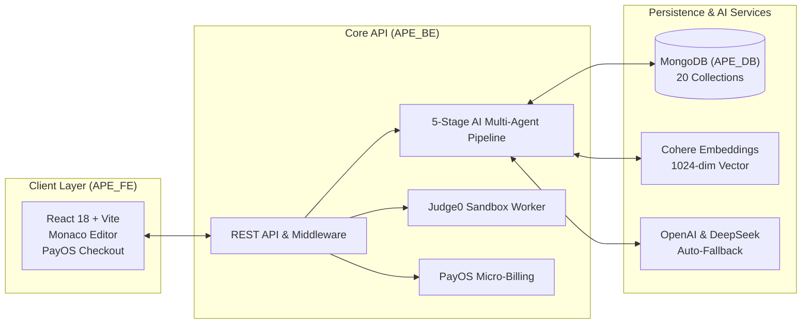

# 🎓 AI-Powered Examination and Programming Practice Platform — APE

<p align="center">
  
  
  
  
  
  
  
  
  
</p>

---

## 📖 Executive Summary

**APE (AI-Powered Examination and Programming Practice Platform)** is an enterprise educational software ecosystem designed for computerized examination, Multiple-Choice Question (FE) training, and Practical Exam (PE) coding assessment powered by an autonomous **Multi-Agent AI architecture** and sandboxed code execution.

This master directory contains the complete source code, automated database tools, AI prototype testbeds, and academic documentation deliverables for the **FPT University Graduation Capstone Project (SEP490 / Group SEP490_G26)**.

---

## 📑 Master Deliverables & Directory Index

```
SEP - 3/
├── ⚙️ APE_BE/                # Production Backend Core API (ASP.NET Core 8, Clean Architecture, 863 Unit Tests)
├── 🌐 APE_FE/                # Production Frontend Web Client (React 18, Vite, Monaco Editor, PayOS Checkout)
├── 🔬 Prototype_AI_Module/   # AI Prototype, Multi-Agent Benchmarking & Prompt Engineering Subsystem
├── 🗄️ Database/               # Complete MongoDB Dump (20 Collections) & 1-Click Import Scripts
├── 📑 Document/               # Official Academic Deliverables (Reports 1 -> 7, Defense PPTX, User Guides)
├── 📈 Benchmark AI Cost/      # Historical AI Token Cost Analysis & Experimental Benchmarks
└── 📄 README.md               # Master Project Overview & Ecosystem Guide (This file)
```

### Directory Breakdown:

| Directory | Subsystem / Asset | Description & Key Responsibilities |
|---|---|---|
| ⚙️ **[`APE_BE/`](APE_BE/README.md)** | **Backend Core API** | ASP.NET Core 8 Web API built with Clean Architecture. Features 5 AI Agent pipelines, Circuit Breaker auto-fallback, asynchronous Judge0 grading worker, PayOS VietQR micro-billing, and **863 Unit Tests (100% Pass Rate)**. |
| 🌐 **[`APE_FE/`](APE_FE/README.md)** | **Frontend Web Client** | Modern SPA built with React 18 + Vite. Integrates **Monaco Code Editor**, real-time timer examination workspaces, automated VietQR modal, Socratic AI Mentor dialogs, and gamified streak/badge analytics. |
| 🔬 **[`Prototype_AI_Module/`](Prototype_AI_Module/README.md)** | **AI Prototype Subsystem** | The foundational C# / .NET 10 research testbed and operator UI used to benchmark token costs, engineer prompt templates, and validate pedagogical evaluation rubrics. |
| 🗄️ **[`Database/`](Database/README.md)** | **Database Dumps & Tools** | 20 exported MongoDB JSON collections (~70 MB) containing complete real-world seed data, along with **1-Click automated import scripts** (`import_database.ps1`, `import_database.sh`). |
| 📑 **`Document/`** | **Academic Documentation** | Complete suite of Capstone reports (**Report 1 to Report 7**), the official Defense Presentation (`CAPSTONE PROJECT DEFENSE - G26.pptx`), System Test Matrices, and User Manuals. |
| 📈 **`Benchmark AI Cost/`** | **Empirical Cost Data** | Baseline cost logs, latency distributions, and empirical token efficiency comparisons across OpenAI, DeepSeek, and Gemini. |

---

## ⚡ End-to-End Quick Start Guide

To run the complete APE system locally from scratch, follow these 3 simple steps:

### Step 1: Initialize the Database (MongoDB)
Make sure a local MongoDB instance (`mongodb://localhost:27017`) is running, then execute the automated import script:
```powershell
cd "Database"
.\import_database.ps1
```

### Step 2: Launch the Backend API (`APE_BE`)
```powershell
cd "..\APE_BE"
dotnet restore
dotnet build APE_Core.sln
dotnet run --project API/API.csproj
```
- 🌐 **Swagger Interactive Documentation:** `http://localhost:5292/swagger`

### Step 3: Launch the Frontend Web App (`APE_FE`)
```powershell
cd "..\APE_FE"
npm install
npm run dev
```
- 🌐 **Client Web Application:** `http://localhost:5173/`

---

## 🧠 Key Architectural Highlights



1. **5-Stage Autonomous Multi-Agent AI Pipeline**:
   - **Gatekeeper Agent**: Academic domain verification & prompt injection filtering.
   - **Vision OCR & Structure Extraction**: Multimodal visual diagram transcription and hierarchical chapter detection.
   - **Semantic Chunking & Cohere Vector Embedding**: Multilingual 1024-dimensional embeddings with overlapping boundary preservation.
   - **Hybrid RAG & 3-Tier Multi-Agent Review Loop**: Generator synthesis, deterministic C# rule verification, LLM pedagogical rubric review, and self-repair loops.
   - **Socratic Code Mentor**: Diagnostic reasoning over compiler/runtime errors without giving away direct code solutions.
2. **Enterprise Reliability & Auto-Fallback**:
   - Zero-downtime database-first configuration resolution (`system_settings` & `ai_agents`).
   - Seamless millisecond auto-fallback between OpenAI and DeepSeek on network errors or rate limits.
3. **High-Integrity Sandboxed Code Execution**:
   - Asynchronous worker queue with race-condition-free attempt leasing and strict hidden test masking.

---

## 🎓 Capstone Project & Academic Information

- **Project Title**: AI-Powered Examination and Programming Practice Platform — APE
- **Group Code**: `SEP490_G26`
- **Institution**: FPT University Hanoi — Department of Computer Science & Software Engineering
- **Course**: SEP490 / Capstone Project (Fall 2026)
- **Academic Advisor**: MSc. Nguyen Manh Hien
- **Final Evaluation**: **Official Graduation Defense Passed on First Attempt with Excellence ✅**

---
*© 2026 APE Team (SEP490_G26) — FPT University. All rights reserved.*
