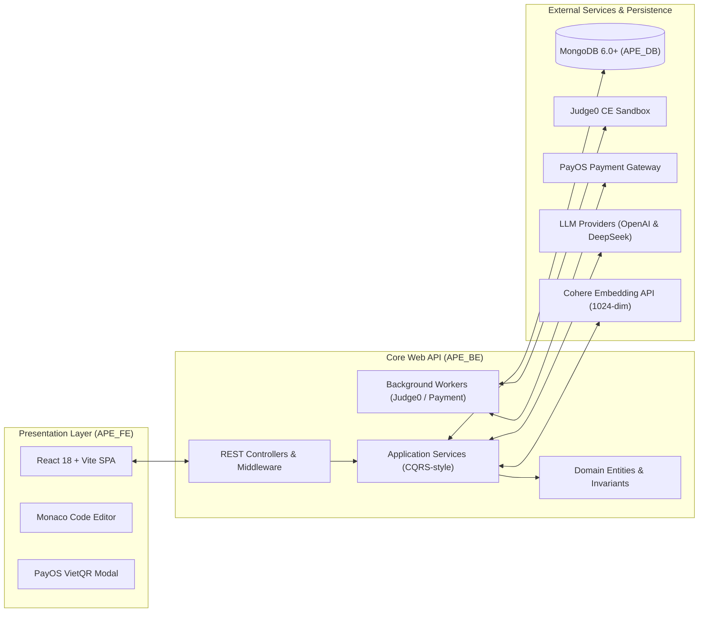

# 🎓 APE — AI-Powered Examination and Programming Practice Platform

<p align="center">
  
  
  
  
  
  
  
  
</p>

---

## 📖 1. Project Overview & Problem Statement

### 1.1 The Educational Challenge
In contemporary computer science education, computerized assessment and programming practice face several critical friction points:
1. **Question Bank Vulnerability & Rote Memorization:** Static question banks suffer from rapid answer leakage, encouraging students to memorize answers rather than understand fundamental software concepts.
2. **High Instructor Overhead:** Manually drafting diverse, balanced examination items aligned with Bloom's taxonomy—complete with verified solution code and robust test suites—is time-intensive.
3. **Static, Uninformative Code Feedback:** Traditional automated grading platforms return binary pass/fail verdicts or raw compiler traces without guiding students toward understanding *why* their algorithm failed, often leading to frustration rather than learning.

### 1.2 The APE Solution
**APE (AI-Powered Examination and Programming Practice Platform)** is a full-stack educational ecosystem engineered to automate curriculum-aligned assessment and adaptive programming practice:
- **BYOS (Bring Your Own Source) Ingestion:** Ingests syllabi, textbooks, and presentation slides (`.pdf`, `.docx`, `.pptx`), transcribing embedded architecture diagrams via multimodal vision OCR.
- **5-Stage Multi-Agent AI Pipeline:** Synthesizes Multiple-Choice Questions (FE) with pedagogical rationales and Practical Coding Challenges (PE) with automated test cases.
- **Sandboxed Execution & Hidden Test Masking:** Executes student code securely via **Judge0 CE** with strict protection against answer leaks.
- **Socratic AI Code Mentor:** Diagnoses compiler and runtime exceptions, offering targeted diagnostic hints without revealing direct code solutions.

---

## ✨ 2. Key Capabilities & Platform Features

| Subsystem | Key Capabilities |
|---|---|
| **Multiple-Choice Exam (FE)** | Automated question generation across cognitive levels (Recall, Comprehension, Application); timed exam simulation; immediate scoring with answer rationales and curriculum citations. |
| **Practical Exam (PE)** | In-browser **Monaco Code Editor**; multi-language compilation (Java, C#, C, C++, Python); automated test grading with private/hidden test suite isolation. |
| **5-Stage AI Pipeline** | Prompt-injection safety gatekeeping; Vision OCR document parsing; semantic boundary chunking; Cohere 1,024-dim vector retrieval; 3-tier pedagogical review and self-repair loops. |
| **Socratic Code Mentor** | Diagnostic parsing of Judge0 execution traces; Socratic debugging hints; anti-leakage guards preventing direct code disclosure. |
| **AI Wallet & Billing** | Automated balance top-up via **PayOS VietQR**; transparent post-pay micro-billing calculated directly from token usage; minimum balance protection gates (`AI balance >= 1,000 VND`). |
| **Governance & Admin** | Super Admin dashboard; curriculum syllabus management; AI model catalog and prompt configuration with zero application downtime. |

---

## 🏛️ 3. System Architecture & Component Interactions

The platform is designed following **Clean Architecture** principles to isolate core business rules from external frameworks, database drivers, and third-party AI APIs.



### Clean Architecture Layers:
- **Domain Layer (`Domain/`):** Pure enterprise entities, value objects, domain exceptions, and system constants without external dependencies.
- **Application Layer (`Application/`):** Core business workflows, service contracts (`Interfaces/`), DTOs, FluentValidation business rules, and AI orchestration pipelines.
- **Infrastructure Layer (`Infrastructure/`):** External integrations including MongoDB repositories, Judge0 client adapters, PayOS payment client, and HTTP LLM provider gateways.
- **Presentation Layer (`API/`):** 27 REST API controllers, JWT authentication middlewares, rate limiting, and asynchronous background worker services.

---

## 🧠 4. AI Subsystem Deep-Dive

```
[Raw Document / Input]
         │
         ▼
 ┌───────────────┐
 │ 1. Gatekeeper │  ---> Pre-checks: Domain relevance, content safety, prompt injection
 └───────┬───────┘
         ▼
 ┌───────────────┐
 │ 2. Extraction │  ---> Text parsing, Vision OCR for UML diagrams, chapter detection
 └───────┬───────┘
         ▼
 ┌───────────────┐
 │  3. Chunking  │  ---> Semantic chunking + Cohere 1024-dim vector embeddings
 └───────┬───────┘
         ▼
 ┌───────────────┐
 │ 4. Generation │  ---> Generator Agent + Deterministic Rules + LLM Reviewer + Self-Repair
 └───────┬───────┘
         ▼
 ┌───────────────┐
 │ 5. Code Mentor│  ---> Judge0 execution diagnostics -> Socratic hints without answer leakage
 └───────────────┘
```

1. **Step 1 — Gatekeeper Agent (`deepseek-v4-flash` / `gpt-4o-mini`):** Evaluates input texts for academic domain relevance (e.g., Object-Oriented Programming, Data Structures), spam detection, and prompt injection defense before token-heavy operations execute.
2. **Step 2 — Document Extraction & Chapter Detection (`gpt-4o`):** Ingests `.pdf`, `.docx`, and `.pptx` documents. Leverages multimodal vision models to transcribe UML diagrams and slide screenshots into markdown, followed by automated chapter/topic structure detection.
3. **Step 3 — Semantic Chunking & Vector Embedding:** Segments text into 500–1,000 token semantic windows with a 100-token overlap; vectorizes chunks using **Cohere `embed-multilingual-v3.0` (1,024 float dimensions)**.
4. **Step 4 — Hybrid RAG & 3-Tier Multi-Agent Review Loop:**
   - **Hybrid Retrieval:** Scopes candidate chunks by chapter/topic metadata combined with vector cosine similarity under a strict token budget.
   - **Generation:** Generator agents (`gpt-5.4` / `deepseek-v4-pro`) produce questions adhering to Bloom taxonomy specifications.
   - **Tier 1 (Deterministic C# Rules):** Validates schema compliance, class signatures, and structural fingerprints (`QuestionFingerprinting.Build`) to prevent template duplication.
   - **Tier 2 (LLM Reviewer `gpt-5.4-mini` / `deepseek-v4-flash`):** Scores distractor plausibility and edge-case test coverage against quantitative rubrics.
   - **Tier 3 (Self-Repair Loop):** Bounded retry cycle (up to 3 attempts) feeding reviewer feedback back into the generator for automated correction.
5. **Step 5 — Socratic Code Mentor:** Parses compiler errors and test outputs from Judge0, formulating guided diagnostic hints without disclosing direct code solutions.
6. **Multi-Provider Routing & Circuit Breaker Fallback:** Client try/catch failover between primary (**OpenAI**) and secondary (**DeepSeek**) providers to prevent service interruption during upstream rate limits or outages.

> 📄 *For a comprehensive personal portfolio report detailing the AI subsystem design, benchmark results, and engineering decisions, see [AI Core Contributions](docs/AI_CORE_CONTRIBUTIONS.md).*

---

## 🛠️ 5. Technology Stack Summary

| Domain | Technology / Tool | Version | Purpose |
|---|---|---|---|
| **Backend Runtime** | .NET / C# | 8.0 / 12.0 | High-performance enterprise Web API |
| **Frontend Framework** | React | 18.3.1 | Component-driven Single Page Application |
| **Frontend Bundler** | Vite | 5.4.10 | Modern dev server and optimized asset bundler |
| **Code Editor** | Monaco Editor | 4.7.0 | In-browser VS Code editing environment |
| **Database** | MongoDB | 6.0+ | Document persistence & Vector storage |
| **AI LLM Providers** | OpenAI / DeepSeek | API v1 | Generation, Review, Gatekeeper, Socratic Mentor |
| **Vector Embedding** | Cohere | API v1 (`embed-multilingual-v3.0`) | 1,024-dimensional semantic text embeddings |
| **Code Execution** | Judge0 CE | v1.13 | Multi-language sandboxed code evaluation |
| **Payment Gateway** | PayOS | Checkout v1 | Automated VietQR payment reconciliation |
| **Authentication** | JWT & Google OAuth 2.0 | RFC 7519 | Role-Based Access Control & Single Sign-On |
| **Testing** | MSTest / Moq / FluentAssertions | v3.6.1 | Automated unit and integration testing |

---

## 👥 6. Team Structure & Contribution Attribution

The APE platform was developed by a 5-member capstone team. The following matrix outlines the confirmed allocation of responsibilities across the project:

| Member | Project Role | Primary Focus Area | Key Deliverables & Responsibilities |
|---|---|---|---|
| **Nguyễn Việt Đức** | Business Analyst & Documentation | Academic Deliverables & Requirements Engineering | Authored official Capstone reports (Reports 1 to 7); business requirements analysis; software requirement specifications (SRS/SDS); use case and activity modeling; academic milestone coordination. |
| **Phạm Quốc Minh** | AI Core & Prototype Developer | AI Pipeline Architecture, RAG & Benchmarking | Requirements analysis and workflow design for the AI processing subsystem; prompt engineering, pedagogical rubrics, and evaluation rules; document extraction, chunking, and Cohere vector embedding integration; development of the `Prototype_AI_Module` benchmark environment; AI provider integration and fallback logic; empirical token/cost analysis; and participation in backend integration testing. *(Implementation was conducted leveraging modern AI-assisted coding tools).* |
| **Vũ Hoàng Anh** | Code Execution & Judge Specialist | Sandboxed Grading Integration | Integration of the Judge0 code execution engine; compilation and runtime client adapters; test case verification workflows; hidden test masking; worker lease polling mechanisms; and code execution evaluation. |
| **Nguyễn Viết Sang** | Fullstack Development & Core Integration | Core Application Backend & System Integration | Core Web API services and MongoDB repositories; system authentication & RBAC; wallet & PayOS webhook transaction handling; fullstack system integration and debugging; collaboration on frontend integration; and end-to-end integration of AI modules into the main system. |
| **Phan Duy Hưng** | Frontend Development & UI Engineering | Web Client Experience & Interface Design | React 18 SPA architecture; Monaco Code Editor integration; student exam workspace; administrative governance dashboards; responsive UI components; state management; and integration of frontend features with backend APIs. |

### 6.1 Personal Contribution Spotlight: Phạm Quốc Minh (AI Core & Prototype)
- **AI Processing Pipeline Design:** Architected the multi-stage pipeline spanning Safety Gatekeeper, Document OCR extraction, Chapter detection, semantic chunking, and Cohere 1,024-dim vector embedding.
- **Prompt Engineering & Quality Control:** Formulated system prompt templates, pedagogical rubrics, Bloom taxonomy alignment rules, and automated self-repair generation loops.
- **AI Prototype Subsystem (`Prototype_AI_Module`):** Engineered the dedicated .NET 10/8 research and testing harness to benchmark provider latencies, evaluate token efficiency, and empirically compare OpenAI, DeepSeek, and Gemini models.
- **System Integration & Debugging:** Integrated AI services into the ASP.NET Core backend, resolving token budget constraints, JSON serialization edge cases, and provider fallback logic.
- **Testing & Benchmarking:** Conducted empirical token usage and cost analysis, while contributing to test scenarios for AI controllers and routing logic.
- *Methodology Note: The AI Core implementation was conducted leveraging modern AI-assisted pair-programming tools. The contributor focused on system analysis, prompt engineering, architecture coordination, integration debugging, and empirical benchmarking rather than manual authoring of the entire backend codebase.*

---

## 📊 7. Quality Assurance & Implementation Status

### 7.1 Component Verification Matrix

| Component / Subsystem | Implementation Status | Verification Level | Notes & Evidence |
|---|:---:|:---:|---|
| **Authentication & RBAC** | Implemented | Tested | Google OAuth SSO, JWT access/refresh token rotation verified. |
| **Course & Question Bank CRUD** | Implemented | Tested | Full curriculum management and question bank approval workflows operational. |
| **Judge0 Sandboxed Grading** | Implemented | Tested | Client adapter and background worker active; supports single and multi-file submissions. |
| **Hidden Test Case Masking** | Implemented | Tested | Private test inputs/outputs sanitized in API responses to prevent leakage. |
| **5-Stage AI Pipeline** | Implemented | Tested | Document extraction, chunking, RAG generation, and review operational in production routes. |
| **AI Provider Fallback** | Implemented | Tested | Circuit breaker failover between OpenAI and DeepSeek active in configuration services. |
| **Socratic AI Code Mentor** | Implemented | Tested | Diagnostic parsing operational; guides student debugging without disclosing solutions. |
| **PayOS Wallet Micro-Billing** | Implemented | Tested | Dynamic VietQR checkout and token-to-VND deduction operational; minimum balance check active. |
| **Async AI Background Queue** | Planned / Deferred | Architectural Target | Documented in `docs/plan/03-ai-async-job-orchestration-performance-plan.md`; deferred to prioritize business logic stability. |

### 7.2 Unit Testing Suite & Methodology
The backend maintains an extensive unit test workbook conforming to FPT University Capstone and MTCA (Management and Testing of Computer Applications) software standards:
- **Test Methodology:** Test cases are categorized into **Normal (N)** valid business flows, **Abnormal (A)** error and security validations, and **Boundary (B)** edge cases.
- **Documented Test Cases:** **863 MSTest Unit Test Cases** designed across 125 backend functions (F01–F125), cataloged in `UnitTests_Report/` and the interactive standalone viewer `UnitTest_Viewer.html`.
- *Status Note:* Test cases represent the validated academic specification; specific test runner harnesses in `BE_UnitTests` require synchronization following later controller consolidations.

---

## ⚠️ 8. Known Engineering Limitations & Trade-offs

1. **Pipeline Latency & Synchronous HTTP Request Execution:**
   - *Observation:* Multi-stage AI generation (retrieval $\rightarrow$ generation $\rightarrow$ 3-tier review $\rightarrow$ self-repair) involves multiple sequential LLM inference calls, resulting in response durations between 15 to 45 seconds.
   - *Current Design:* AI endpoints currently execute synchronously within the HTTP request lifecycle.
   - *Architecture Plan:* An asynchronous job queue model (persisting requests to MongoDB, returning an immediate `jobId`, and processing via background workers) was drafted (`docs/plan/03-ai-async-job-orchestration-performance-plan.md`) and deferred as a post-stabilization enhancement.
2. **Token Economics & Model Inference Costs:**
   - *Observation:* Complex RAG context packs and Vision OCR for multi-page slide decks incur noticeable token consumption.
   - *Mitigation:* The system enforces strict token budgeting during chunk assembly (`ai_context_packs`) and requires a minimum wallet threshold (`AI balance >= 1,000 VND`) before initiating generation.

---

## 📂 9. Repository Structure & Deliverables

```
APE/
├── ⚙️ APE_BE/                # Production ASP.NET Core 8 Web API (Clean Architecture)
├── 🌐 APE_FE/                # Production React 18 + Vite Web Client (Monaco Editor)
├── 🔬 Prototype_AI_Module/   # Independent .NET 10 AI Research, Benchmark & Operator UI
├── 🗄️ Database/               # Complete MongoDB Dump (20 Collections) & 1-Click Import Scripts
├── 📑 Document/               # Official Academic Deliverables (Reports 1 to 7, Defense PPTX, User Guides)
├── 📈 Benchmark AI Cost/      # Historical AI Token Cost Analysis & Experimental Benchmarks
├── 📚 docs/                   # In-depth Technical Documentation (AI Core Portfolio Report)
├── 🛡️ .gitignore              # Monorepo secret and build artifact exclusion rules
└── 📄 README.md               # Master Project Documentation (This file)
```

---

## 🚀 10. Getting Started & Local Reproduction

### Prerequisites
- **.NET 8.0 SDK** (v8.0.x or newer): [Download .NET](https://dotnet.microsoft.com/download/dotnet/8.0)
- **Node.js** (v18.x or v20.x LTS): [Download Node.js](https://nodejs.org/)
- **MongoDB** (Local instance at `mongodb://localhost:27017` or MongoDB Atlas URI)

---

### Step 1: Initialize Database (1-Click Setup)
The `Database/` directory includes automated scripts to seed all 20 collections into your MongoDB instance:
```powershell
cd Database
# Import to local MongoDB instance:
.\import_database.ps1

# Or import to MongoDB Atlas Cloud:
# .\import_database.ps1 -Uri "mongodb+srv://<user>:<password>@cluster.mongodb.net/APE_DB"
```

---

### Step 2: Configure & Run Backend API (`APE_BE`)
```powershell
cd ..\APE_BE

# Copy example configuration to .env and input your API credentials:
Copy-Item .env.example .env

# Restore dependencies and build solution:
dotnet restore
dotnet build APE_Core.sln

# Launch ASP.NET Core Web API:
dotnet run --project API/API.csproj
```
- 🌐 **Interactive Swagger Documentation:** `http://localhost:5292/swagger`

---

### Step 3: Run Frontend Web Client (`APE_FE`)
```powershell
cd ..\APE_FE

# Install NPM dependencies:
npm install

# Start Vite development server:
npm run dev
```
- 🌐 **Web Application Portal:** `http://localhost:5173/`

---

## 🎓 11. Capstone & Academic Information

- **Project Title:** AI-Powered Examination and Programming Practice Platform — APE
- **Capstone Group:** `SEP490_G26`
- **Institution:** FPT University Hanoi — Department of Computer Science & Software Engineering
- **Course:** SEP490 / Capstone Project (Fall 2026)
- **Academic Advisor:** MSc. Nguyen Manh Hien
- **Final Evaluation:** **Official Graduation Defense Passed on First Attempt with Excellence ✅**

---
*© 2026 APE Team (SEP490_G26) — FPT University. All rights reserved.*
