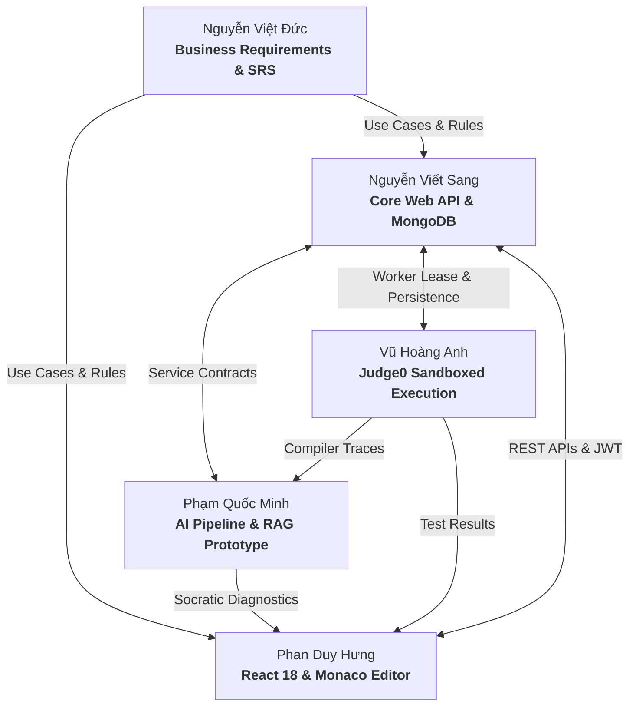

# 👥 APE — Team Contributions & Responsibilities

**Project:** APE — AI-Powered Examination and Programming Practice Platform  
**Capstone Group:** SEP490_G26 — FPT University Hanoi  
**Academic Term:** Fall 2026  
**Academic Advisor:** MSc. Nguyen Manh Hien  

---

## 1. Collaborative Engineering Overview

The **APE (AI-Powered Examination and Programming Practice Platform)** was designed, implemented, and delivered through the collaborative effort of five software engineering students. 

To build an enterprise-grade computerized assessment platform combining curriculum ingestion, multi-model AI synthesis, sandboxed multi-language code compilation, and automated payment gateways, the team established a cross-functional workflow. Each member assumed primary ownership over specific technical and academic domains while actively collaborating across interface boundaries, integration testing, and project defense milestones.

---

## 2. Individual Contributions & Deliverables

```
┌────────────────────────────────────────────────────────────────────────┐
│                      SEP490_G26 CAPSTONE TEAM                          │
├──────────────────┬──────────────────┬──────────────────┬───────────────┤
│  Nguyễn Việt Đức │  Phạm Quốc Minh  │   Vũ Hoàng Anh   │Nguyễn ViếtSang│
│(BA & Docs Lead)  │  (AI Core & Proto│ (Judge Specialist│(Fullstack/Int)│
├──────────────────┴──────────────────┴──────────────────┴───────────────┤
│                             Phan Duy Hưng                              │
│                      (Frontend & UI Engineering)                       │
└────────────────────────────────────────────────────────────────────────┘
```

---

### 1. Nguyễn Việt Đức — Business Analyst & Documentation

**Primary Responsibilities**
- End-to-end business requirements engineering, user persona modeling, and academic documentation management.
- Authoring and maintaining the formal Capstone deliverables (Reports 1 through 7) under FPT University standards.
- Defining functional and non-functional specifications, Use Case specifications, and business activity workflows.

**Key Contributions**
- **Academic Capstone Documentation Suite:** Led the authoring and compilation of all official academic reports (Reports 1 to 7), Software Requirement Specifications (SRS), and Software Design Specifications (SDS).
- **Business Process Modeling:** Modeled comprehensive business workflows for student examination sessions, BYOS personal material ingestion, instructor question bank governance, and automated wallet transactions.
- **Pedagogical Assessment & Billing Rules:** Formulated core system policies, including Bloom's taxonomy distribution targets, question validation criteria, and the student-facing VND wallet balance rules (`AI balance >= 1,000 VND`).
- **Milestone & Defense Coordination:** Coordinated project tracking documentation, weekly status reports, and the final thesis defense presentation (`CAPSTONE PROJECT DEFENSE - G26.pptx`).

**Technical Deliverables**
- `Document/Report1_Project Introduction.docx` to `Document/Report7_Final Project Report.docx`.
- `Document/Report3_Software Requirement Specification.docx` & `Report4_Software Design Specification.docx`.
- `Document/Report6_Software User Guides.docx`.
- `Document/Project_Weekly_Report_Group_26_W7_W12_Professional_v2.xlsx`.
- Business flow specifications documented in `APE_BE/docs/billing/AI_VND_Billing_Business_Flow_For_BA.md`.

**Collaboration & Integration**
- Partnered with Fullstack and Frontend developers to validate that implemented UI flows and API responses aligned with SRS use case specifications.
- Collaborated with the AI Core developer to translate technical LLM token consumption into clear, user-friendly VND billing business rules.

**Challenges & Engineering Decisions**
- Reconciling complex technical AI token behaviors into predictable financial rules for students, establishing the direct VND debit model with absorbed loss protection.

**References**
- `Document/` (Academic documentation repository).
- `APE_BE/docs/billing/AI_VND_Billing_Business_Flow_For_BA.md`.

---

### 2. Phạm Quốc Minh — AI Core & Prototype Developer

**Primary Responsibilities**
- Requirements analysis, architectural design, and workflow orchestration for the AI processing subsystem.
- Formulation of system prompt templates, quantitative evaluation rubrics, and pedagogical generation rules.
- Engineering the independent research prototype and benchmark testbed (`Prototype_AI_Module`).
- Integration of multimodal document extraction, semantic chunking, Cohere vector embeddings, and RAG workflows.
- Empirical benchmarking of token consumption, latency baselines, and inference costs across LLM providers.
- *Methodology Note: AI Core development was conducted leveraging modern AI-assisted engineering tools. The contributor focused on system requirements, workflow architecture, prompt engineering, integration debugging, and empirical benchmarking rather than manual authoring of the entire backend codebase.*

**Key Contributions**
- **5-Stage AI Pipeline Architecture:** Designed the end-to-end processing pipeline spanning Safety Gatekeeper, Multimodal Vision OCR extraction, Chapter detection, semantic chunking, and Cohere vector embedding.
- **Prompt Engineering & Quality Control:** Formulated structured prompt templates, Bloom taxonomy specifications, and the 3-tier review and self-repair loop for Multiple-Choice (FE) and Practical Coding (PE) items.
- **AI Prototype Subsystem (`Prototype_AI_Module`):** Engineered the standalone .NET research testbed and operator UI to empirically compare candidate models across OpenAI, DeepSeek, and Google Gemini.
- **RAG & Vector Retrieval Integration:** Integrated Cohere `embed-multilingual-v3.0` (1,024 dimensions) for cross-lingual academic retrieval with strict token budget enforcement.
- **Reliability & Multi-Provider Fallback:** Implemented client-level try/catch circuit-breaker failover between OpenAI and DeepSeek to safeguard against upstream outages.

**Technical Deliverables**
- `Prototype_AI_Module/` (standalone .NET 10/8 research harness, operator UI, and prompt/rubric catalogs).
- `APE_BE/Application/Services/AIExtractedContentService.cs`, `QuestionGenerationReviewService.cs`, and `CodeMentorService.cs`.
- `APE_BE/Infrastructure/AI/` (LLM provider HTTP gateways and failover policies).
- Subsystem documentation in `docs/AI_CORE_CONTRIBUTIONS.md` and `APE_BE/docs/ai/`.

**Collaboration & Integration**
- Collaborated with Fullstack developer (Nguyễn Viết Sang) to integrate AI service contracts into core Web API controllers and MongoDB persistence models.
- Collaborated with Frontend developer (Phan Duy Hưng) on interactive UI previews for document extraction and Socratic mentor dialogs.
- Collaborated with Judge Specialist (Vũ Hoàng Anh) to feed execution diagnostic traces into the Socratic Code Mentor.

**Challenges & Engineering Decisions**
- Managing synchronous HTTP request latency during multi-step LLM calls while deferring background job queuing to prioritize business logic stability.
- Establishing deterministic C# validation rules (`QuestionFingerprinting.Build`) to prevent template duplication and output schema drift.

**References**
- `docs/AI_CORE_CONTRIBUTIONS.md` (Detailed subsystem case study).
- `Prototype_AI_Module/README.md`.
- `APE_BE/docs/ai/`.

---

### 3. Vũ Hoàng Anh — Code Execution & Judge Specialist

**Primary Responsibilities**
- Design and integration of the automated code compilation and execution engine for Practical Exams (PE).
- Integration and communication adapters for the **Judge0 CE** sandboxed execution environment.
- Implementation of the asynchronous background submission grading worker and polling workflows.
- Verification and enforcement of hidden test case confidentiality to prevent answer leakage.

**Key Contributions**
- **Judge0 Client & Adapter Architecture:** Integrated the `Judge0Client.cs` adapter supporting multi-language compilation (Java, C#, C, C++, Python) with configurable execution limits.
- **Asynchronous Submission Grading Worker:** Engineered `Judge0Worker.cs` with atomic attempt leasing, polling intervals, and lease renewal to manage execution queues reliably.
- **Verdict & Evaluation Engine:** Implemented `SubmissionResultEvaluator.cs` to normalize compiler outputs, map exit codes, and calculate final test scores across public and private suites.
- **Hidden Test Suite Protection:** Enforced strict response sanitization in `PESubmissionService.cs` ensuring private test inputs, expected outputs, and raw failure diffs are obfuscated from client responses.

**Technical Deliverables**
- `APE_BE/Infrastructure/Judge0/` (client adapters, source package builders, authentication modes, batch requests).
- `APE_BE/API/Workers/Judge0Worker.cs` (background grading service).
- `APE_BE/Application/Services/SubmissionGradingProcessor.cs` & `SubmissionResultEvaluator.cs`.
- `APE_BE/Domain/Entities/PE_Submission.cs`.
- Audit and architecture specifications in `APE_BE/docs/judge-rewrite/`.

**Collaboration & Integration**
- Collaborated with Fullstack developer on submission persistence in MongoDB and controller submission endpoints.
- Collaborated with Frontend developer to ensure real-time polling mechanisms and test result rendering in the Monaco editor workspace.
- Provided structured compiler and runtime error models used by the AI Code Mentor for diagnostic analysis.

**Challenges & Engineering Decisions**
- Mitigating external Judge0 API rate limits and execution timeouts during multi-test batch processing through managed polling intervals.
- Designing strict isolation between student execution containers and the core application server.

**References**
- `APE_BE/Infrastructure/Judge0/`.
- `APE_BE/docs/judge-rewrite/01_MANAGED_JUDGE_ARCHITECTURE.md`.
- `APE_BE/docs/judge-rewrite/00_CURRENT_STATE_AUDIT.md`.

---

### 4. Nguyễn Viết Sang — Fullstack Development & Core Integration

**Primary Responsibilities**
- Architectural design and maintenance of the core ASP.NET Core Clean Architecture backend solution (`APE_Core.sln`).
- User authentication, role-based authorization (RBAC), and session security lifecycles.
- Payment gateway integration (PayOS VietQR) and student wallet transaction workflows.
- MongoDB persistence repository implementation, schema indexing, and database seeding.
- Overall system integration, cross-module debugging, and production backend stability.

**Key Contributions**
- **Clean Architecture Backend Core:** Structured and maintained the primary ASP.NET Core Web API following strict layer separation (`Domain`, `Application`, `Infrastructure`, `API`).
- **Authentication & Security Subsystem:** Implemented Google OAuth 2.0 Single Sign-On and secure JWT access/refresh token rotation (`AuthService.cs`, `JwtTokenGenerator.cs`).
- **PayOS VietQR Payment Gateway:** Engineered automated top-up order generation and webhook signature verification using HMAC-SHA256 (`WalletTopupService.cs`, `PaymentWebhookController.cs`).
- **Wallet & Micro-Billing Integration:** Implemented atomic wallet transaction workflows, debiting balances based on AI token telemetry with minimum balance protection.
- **Data Persistence & Database Bootstrap:** Designed MongoDB document repositories and automated initial data seeding (`DevDatabaseBootstrap.cs`).

**Technical Deliverables**
- `APE_BE/Application/Services/AuthService.cs`, `WalletTopupService.cs`, `UserService.cs`, and `CourseService.cs`.
- `APE_BE/Infrastructure/Persistence/` (MongoDB repositories and Unit of Work implementation).
- `APE_BE/API/Controllers/` (Authentication, Wallet, Payment, User, and Course controllers).
- `APE_BE/Tools/DevDatabaseBootstrap/` and database migration utilities.
- Integration support across `APE_FE/src/services/`.

**Collaboration & Integration**
- Collaborated with Frontend developer (Phan Duy Hưng) on REST API contracts, authentication headers, and CORS configurations.
- Collaborated with AI Core developer to integrate AI service interfaces, MongoDB billing transaction models, and agent catalogs.
- Partnered with Judge Specialist on submission data models and transaction consistency.

**Challenges & Engineering Decisions**
- Designing atomic wallet balance debit operations to prevent race conditions during concurrent user practice sessions.
- Managing distributed MongoDB document structures and compound indexes across 20 production collections.

**References**
- `APE_BE/Application/Services/WalletTopupService.cs`.
- `APE_BE/Application/Services/AuthService.cs`.
- `APE_BE/Infrastructure/Persistence/`.

---

### 5. Phan Duy Hưng — Frontend Development & UI Engineering

**Primary Responsibilities**
- Client-side Single Page Application (SPA) architecture and user interface engineering.
- Design and implementation of the student examination and practice workspaces.
- Integration of the in-browser **Monaco Code Editor** with real-time compilation feedback.
- Super Admin governance dashboards and document review portals.
- Client state management, routing guards, and backend API integration.

**Key Contributions**
- **Modern React 18 + Vite Web Client:** Engineered the client application featuring responsive UI layouts, clean component modularization, and custom theme systems.
- **In-Browser Monaco Code Editor Integration:** Integrated the VS Code editing engine (`@monaco-editor/react`), supporting syntax highlighting, indentation, and multi-file code editing for PE exams.
- **Student Exam & Practice Workspace:** Implemented full exam simulation interfaces, including synchronized countdown timers, question palettes, test case status viewers, and Socratic hint dialogs.
- **Super Admin Governance Portal:** Developed administrative interfaces for curriculum course management, document approval workflows, user management, and AI agent monitoring.
- **Client Lifecycle & Navigation Guards:** Implemented `useBeforeUnloadGuard` and `useInFlightGuard` to prevent accidental exit and loss of student exam progress.

**Technical Deliverables**
- `APE_FE/src/pages/` (Student exam workspace, Admin management portals, Authentication pages).
- `APE_FE/src/modules/` (Curriculum practice modules, BYOS upload and preview workflows).
- `APE_FE/src/services/` (HTTP fetch wrappers, token refresh interceptors, and service clients).
- `APE_FE/src/shared/guards/` (exam lifecycle and navigation guards).
- PayOS dynamic VietQR checkout modal integration.

**Collaboration & Integration**
- Collaborated with Fullstack developer (Nguyễn Viết Sang) on API contract alignment, JWT token refresh interceptors, and error handling.
- Collaborated with Judge Specialist to render execution output traces, compiler errors, and test pass/fail badges in the Monaco workspace.
- Collaborated with AI Core developer to build intuitive UI previews for OCR document parsing and interactive Socratic mentor dialogs.

**Challenges & Engineering Decisions**
- Optimizing high-frequency Monaco editor state and execution polling to eliminate unnecessary React re-renders during timed coding exams.
- Ensuring seamless UX across dark/light theme switching without relying on heavy third-party UI component libraries.

**References**
- `APE_FE/README.md`.
- `APE_FE/src/pages/student/`.
- `APE_FE/src/modules/`.

---

## 3. Cross-Team Integration & Engineering Workflows

The delivery of APE relied on tight cross-discipline integration across the five team roles:



1. **Requirements to Implementation:** Business requirements defined by the BA guided entity schemas in the backend and user workflows in the frontend.
2. **API & Contract Alignment:** Fullstack and Frontend developers synchronized request/response DTOs to ensure seamless student session management.
3. **Execution to Diagnosis:** When a student submits code, the Judge Specialist's execution engine compiles the code and generates execution traces. If failures occur, the AI Core subsystem parses these traces to deliver Socratic debugging hints directly into the Frontend Monaco workspace.
4. **Billing & Usage Settlement:** Every AI generation triggers token telemetry recorded by the AI Core, which is then processed by the Fullstack wallet service to debit student VND balances according to business rules defined by the BA.

---

## 4. Supporting Subsystem Documentation

This document serves as the team-wide contribution record. For deep technical case studies into specific platform subsystems:
- 🧠 **[AI Core Subsystem Case Study](AI_CORE_CONTRIBUTIONS.md):** Detailed analysis of the 5-stage AI pipeline, RAG vector retrieval, prompt templates, self-repair loops, and empirical token/cost benchmarks.
- Additional subsystem technical case studies may be added by respective owners as further documentation is compiled.

---
*© 2026 APE Team (SEP490_G26) — FPT University Hanoi. All rights reserved.*
